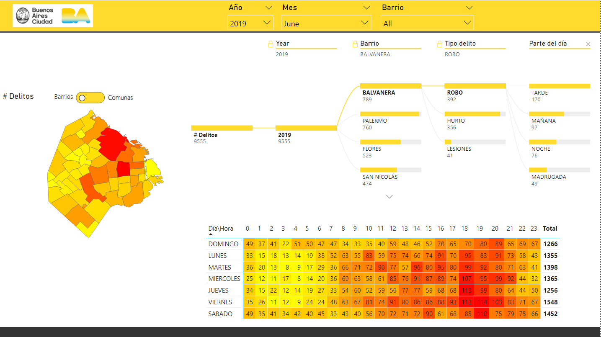
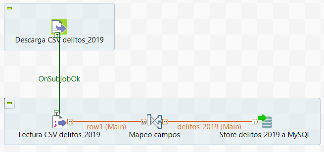
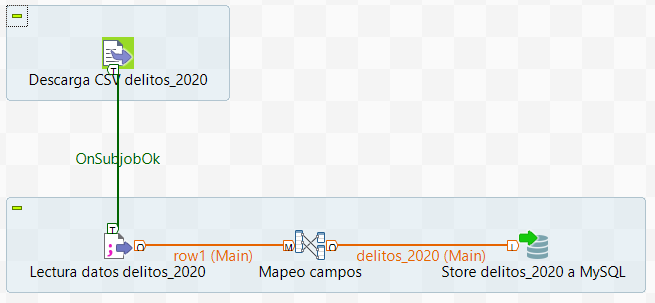
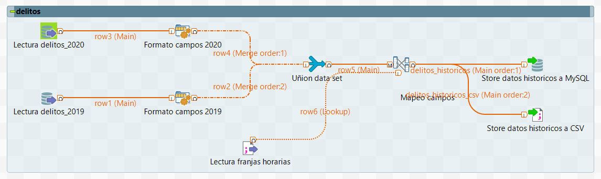
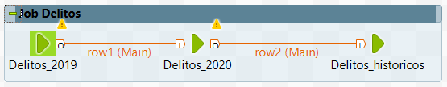

# 🔫 Análisis de datos de delitos CABA

Se realiza un proceso etl utilizando los datos publicos de delitos de CABA brindado por el gobierno de la ciudad autonoma de buenos aires.  
Se busca indentificar si la pandemia afecto en la cantidad de delitos, además analizar sus zonas, horarios, dias, barrios y comunas.

 

## 📰 Fuente de datos

Los datos utilizados son de los años 2019 y 2020 para nuestro análisis.

Delitos 2020:
```url
https://cdn.buenosaires.gob.ar/datosabiertos/datasets/ministerio-de-justicia-y-seguridad/delitos/delitos_2020.csv
```

Delitos 2019:
```url
https://cdn.buenosaires.gob.ar/datosabiertos/datasets/ministerio-de-justicia-y-seguridad/delitos/delitos_2019.csv
```

 

## 💻 Proceso

El proceso de tranformación se realizó con la app Talent Open Studio.  

- [X] Descarga de archivos csv 
- [X] Guardado en base de datos MySQL
- [X] Selección de campos a utilizar
- [X] Normalización de campos
- [X] Quitado de espacios en los campos
- [X] Mayusculas en todos los campos
- [X] Corrección de fechas
- [X] Agregar información extra de franjas horarias
- [X] Unión de los data set limpios de 2019 y 2020
- [X] Guardado de los datos finales en la base de datos MySQL
- [X] Export en formato CSV

 

## 📊 Visualización

Requisitos:

* Power BI desktop
```url
https://powerbi.microsoft.com/es-es/
```

El archivo del tablero es ***"Analisis delitos CABA .pbix"***

  

Tambien se puede acceder a la versión cloud del tablero publico en el siguiente link:

```url
https://app.powerbi.com/view?r=eyJrIjoiMWViZDM5OGEtMTVmOC00ZmExLTkwYTMtNjRlYzk3NzJkZjRiIiwidCI6IjViODA2NTZiLWQ2Y2ItNDYwMC1iNGRlLTExNDlhYTUxNTUwYSIsImMiOjR9&pageName=ReportSection
```


 

## 🗂️ Base de datos

Los datos de la base de datos son:  
- **Tipo:** MySQL  
- **Server:** 127.0.0.1  
- **Port:** 3306  
- **Base de datos:** db_caba  
- **Usuario:** db_user  
- **Password:** ver archivos secrets  
- **Tablas:**
  * delitos_2019
  * delitos_2020
  * delitos_historicos
  * talend_stats

*Se utilizo MySQL pero podria reemplazarse con cualquier otro tipo de base de datos.*

 

## 💾 Instalación

Requisitos:

* Docker

```url
https://www.docker.com/get-started
```

* Java 8

```url
https://www.oracle.com/java/technologies/downloads/#java8
```

```url
https://java.tutorials24x7.com/blog/how-to-install-java-8-on-windows-10
```

```url
https://medium.com/@devkosal/switching-java-jdk-versions-on-macos-80bc868e686a
```

* Git
  
```url
https://git-scm.com
````

 

1. Clonar repositorio

```url
git clone https://github.com/ezeparziale/analisis-data-delitos.git .
```

2. Descargar Talend Open Studio

```
https://www.talend.com/products/talend-open-studio/
```

3. Pasos de instalación
```
https://help.talend.com/r/Je8asIdye4c8h1JTL~NcVQ/7ujZ9bjh8IA~zh8LJjsRPw
```

Recomendado en windows dejarlo en ***C:\talend***

 

## 🏃‍♂️ Ejecución

1. Ejecutar Talend e importar el workspace que se encuentra dentro de la carpeta ***"talend"*** dentro del repositorio.

2. Ejecutar el archivo ***docker-compose.yaml***

```terminal
docker-compose -f "docker-compose.yaml" up -d
```

3. Ejecutar procesos en talend:

Dentro del workspace se encuentran los siguientes jobs:

* Delitos_2019
  
Descarga el archivo CSV y lo guarda en la base de datos MySQL, tabla "delitos_2019"



 
* Delitos_2020
 
Descarga el archivo CSV y lo guarda en la base de datos MySQL, tabla "delitos_2020"



 
* Delitos_historicos

Se procesan las tablas "delitos_2019" y "delitos_2020", se normalizan campos y se vincula la info del csv llamado "./extras/franja_horaria.csv". Se exporta la información final al archivo ***"./csv/delitos_historicos.csv"***




 
* Job_Recarga_Delitos_CABA

Es el job principal que ejecuta los job de transformaciones en el siguiente orden: "delitos_2019" >> "delitos_2020" >> "Delitos_historicos"




 

## 📂 Estructura de carpetas

```
analisis-data-delitos
│   Readme.md
│   docker-compose.yaml    
│   Analisis delitos CABA.pbix
|
└───csv
|   │   delitos_2019.csv
|   │   delitos_2020.csv
|   |   delisto_historicos.csv
|   | 
└───db_data
|   │   ...
|   |
└───extras
|   │   franja_horaria.csv
|   |   poblacion.xlsx
|   |
└───img
|   │   ...
|   |
└───map
|   │   map_barrios.topojson
|   │   map_comunas.topojson
|   |
└───secrets
|   │   db_password
|   │   db_root_password
|   |
└───talend
|   └───WORKSPACE_TALEND_DELITOS_CABA
|       |   ...
```


## 📚 Bibliografia

Datos publicos del gobierno de la ciudad:
```url
https://data.buenosaires.gob.ar/dataset/delitos
```

Datos estadisticos de poblicacion, superficie y densidad de población
```url
https://www.estadisticaciudad.gob.ar/eyc/?p=76599
```

Nota diario Clarin:
```url
https://www.clarin.com/policiales/mapa-delito-porteno-indice-inseguridad-robos-violentos_0_8DU3T0_Uy.html
```

Nota diario La Nación:
```url
https://www.lanacion.com.ar/seguridad/los-delitos-bajaron-37-a-nivel-mundial-por-las-restricciones-en-la-pandemia-nid02062021/
```
